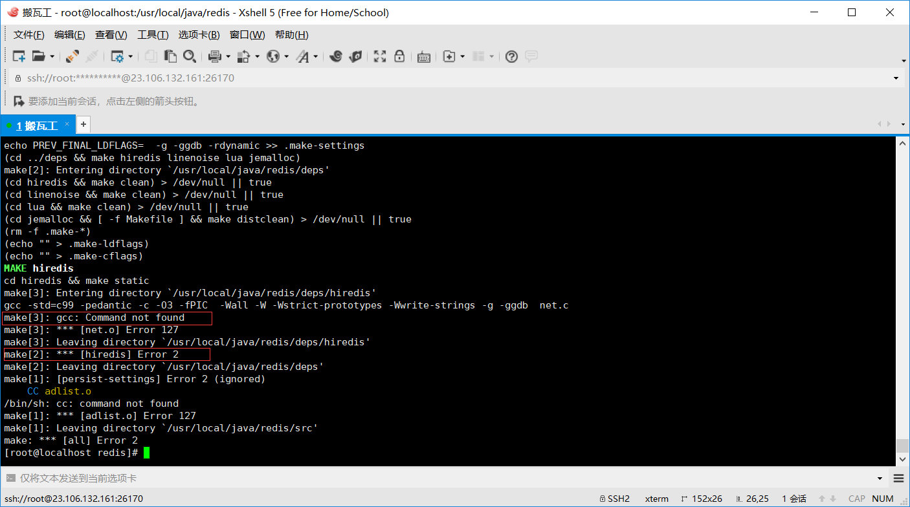
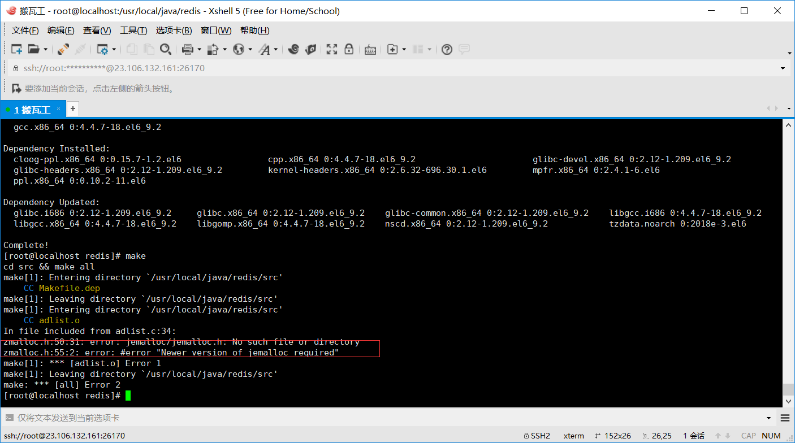

> redis-in-action学习笔记

# linux系统安装redis

### 安装单机redis服务

1. 下载redis压缩包并解压 [下载路径](https://redis.io/)
2. make命令编译源文件 
	
	解决方法：linux系统下下载gcc命令 yum install gcc
	
	解决方法: [执行make命令时设置MALLOC=jemalloc参数](https://blog.csdn.net/bugall/article/details/45914867)
3. make install
4. redis-server redis.conf启动redis程序

### 安装python语言redis客户端
1.查看linux是否安装python(默认安装的python版本,没有则安装)
	python --version

2.下载setuptools模块并解压缩文件
	[下载地址](https://pypi.io/packages/source/s/setuptools/setuptools-33.1.1.zip)

3.进入解压文件夹执行python命令安装reids hiredis客户端
	sudo python -m easy_install redis hiredis
	[安装报错 error: Setup script exited with error: command 'gcc' failed with exit status 1](./../img/redis-setup/setuptools-error-1.png)
	问题:编译文件出错，需要安装python-devel(yum install python-devel) [原文路径](https://blog.csdn.net/qq_41746437/article/details/79340299 "why need python-devel")

4.执行如下命令  
	python  
	>>>import redis  
	>>>conn = redis.Redis()  
	>>>conn.set('hello','world')  
若返回true则表示成功（前提是redis服务要启动，否则会报连接异常错误）

### 将redis设置为开机自启动
[原文连接](http://blog.csdn.net/lovejj1994/article/details/53096268)

	