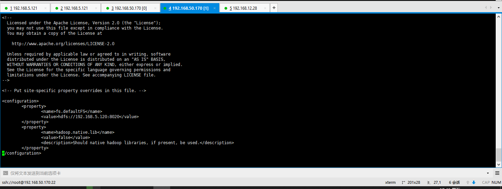
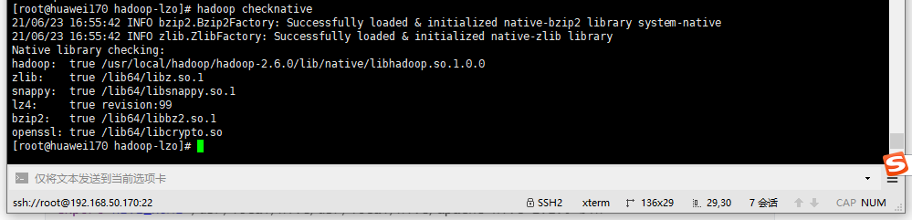
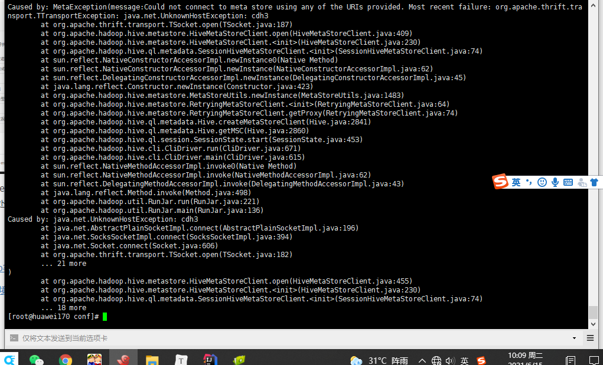
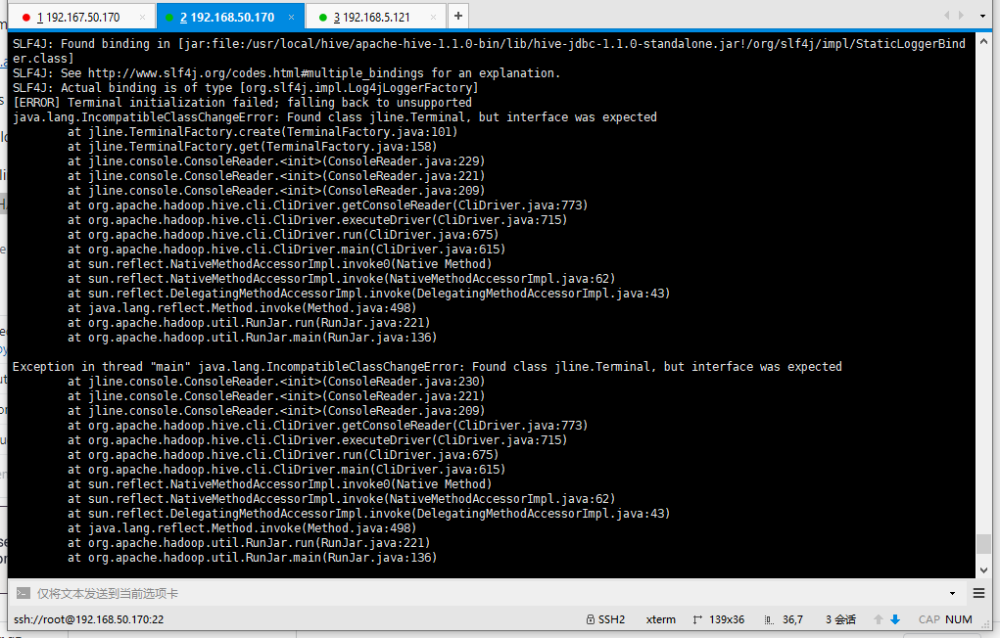
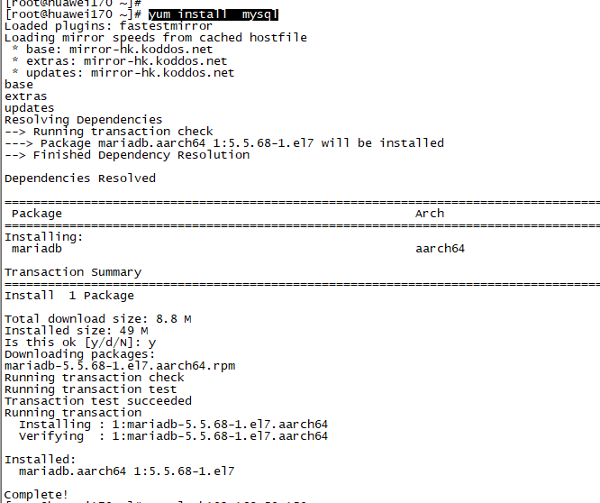
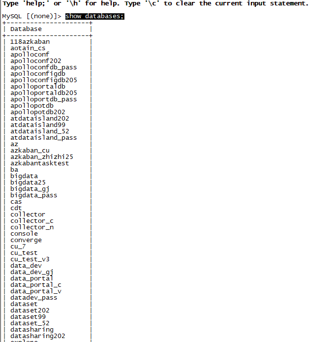
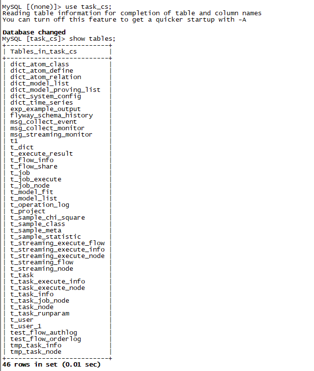
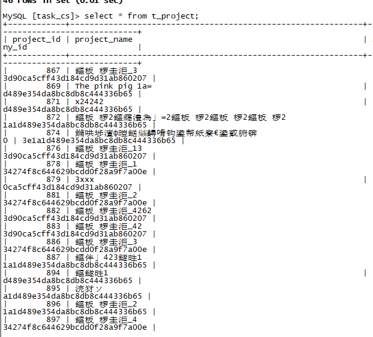

### arm架构hadoop客户端安装(tar.gz资源文件在百度网盘)

1.查看cdh对应的hadoop`版本`

​		根据`jps -l -m -v|grep lib/hadoop`确定hadoop lib目录(/opt/cloudera/parcels/CDH-5.14.0-1.cdh5.14.0.p0.24/lib/hadoop)

​		`cd  /opt/cloudera/parcels/CDH-5.14.0-1.cdh5.14.0.p0.24/lib/hadoop`查看hadoop版本(2.6.0)

2.下载arm服务器架构对应版本hadoop文件，并解压hadoop压缩文件

3.安装hadoop需要的jdk

​		配置jdk和hadoop环境变量

```shell
export JAVA_HOME=/root/sotware/java/jdk1.8.0_271
export PATH=$JAVA_HOME/bin:$PATH
export HADOOP_HOME=/usr/local/hadoop/hadoop-2.6.0
export PATH=$PATH:$HADOOP_HOME/bin:$PATH
```

4.安装hadoop客户端环境

修改hadoop-env.sh		

​	  在文件开头增加 `. /etc/profile` 	

修改`core-site.xml` ，在<configuration>节点下增加以下属性，修改完的文件如图.

通过namenode管理页面查看http://192.168.5.120:50070/ hdfs服务端端口

```xml
   <property>
            <name>fs.defaultFS</name>
            <value>hdfs://192.168.5.120:8020</value>
    </property>
    <property>
            <name>hadoop.native.lib</name>
            <value>false</value>
            <description>Should native hadoop libraries, if present, be used.			             </description>
    </property>
```

5. 检查hadoop native是否正常,确保执行hadoop nativecheck得到如下图结果

   


### arm架构hive客户端安装


```shell
export HIVE_HOME=/usr/local/hive/usr/local/hive/apache-hive-1.1.0-bin
export PATH=$PATH:$HIVE_HOME/bin:$PATH
```


1.查看cdh对应的hive`版本`

​		根据`jps -l -m -v|grep lib/hive`确定hadoop lib目录(`/opt/cloudera/parcels/CDH-5.14.0-1.cdh5.14.0.p0.24/lib/hive/lib`)

​		`cd  /opt/cloudera/parcels/CDH-5.14.0-1.cdh5.14.0.p0.24/lib/hive/lib`查看hive版本(1.1.0)

2. 下载对应版本hive压缩文件并解压

3. 进入cdh页面下载服务对应client配置，并使用此配置文件替换掉hive解压包中conf目录下的配置文件

4. 启动hive，如果出现如下报错，下载hadoop版本对应的`hadoop-mapreduce-client-core-2.6.0.jar`包(注意，此处为2.6.0)

5. 若此时出现下图错误，说明此服务器没有配置对应的hosts信息,增加集群hosts配置信息

   

6. 如果出现如下报错,在/etc/profile中设置变量`export HADOOP_USER_CLASSPATH_FIRST=true`

   

7. 此时可正常启动hive客户端，并执行相关操作(操作lzop压缩表报错，需要在arm服务器上编译hadoop和hadoop-lzo包)

   **详见hadoop arm64架构源码编译章节以及hadoop-lzo编译章节(如果只部署，获取相关编译后压缩包即可，不用了解详细的编译过程)**

   ****

8. 配置hadoop-lzo环境(需要编译安装,不能只copy一个jar包)

   1. 本机环境安装lzop 1.03和LZO library 2.06
   2. 获取hadoop-lzo-arrch64.rar包并解压
   3. 将解压出来文件 target/hadoop-lzo-0.4.20.jar包复制到$HADOOP_HOME/share/hadoop/common目录下
   4. 将解压出来文件 target/native/Linux-aarch64-64/lib/libgplcompression* 文件复制到 $HADOOP_HOME/lib/native/ 目录下 

   

参考资料:

[安装hadoop客户端环境](https://www.cnblogs.com/zhangyinhua/p/7678704.html#_label0)

[arm麒麟环境安装hadoop](http://blog.itpub.net/69985104/viewspace-2760923/)

[hive集群client配置](https://www.jwldata.com/archives/117.html)

[Found class jline.Terminal.but interface was expected](https://stackoverflow.com/questions/28997441/hive-startup-error-terminal-initialization-failed-falling-back-to-unsupporte)

[hive Failed with exception java.io.IOException:java.lang.RuntimeException: Error in configuring object](https://community.cloudera.com/t5/Support-Questions/Hive-Queries-are-not-executing-Showing-Exceptions-in-CLI/td-p/28426)


资源下载路径

[hive压缩包下载路径](https://www.jwldata.com/archives/117.html)

[hadoop-mapreduce-client-core jar包下载路径](https://mvnrepository.com/artifact/org.apache.hadoop/hadoop-mapreduce-client-core/2.6.0)


### arm架构hbase客户端安装

1. 查看cdh对应的hbase`版本`

2. 下载对应版本hbase压缩文件并解压
3. 进入cdh页面下载服务对应client配置，并使用此配置文件替换掉hbase解压包中conf目录下的配置文件
4. 执行hbase相关操作


### arm架构mysql客户端安装

1. 先检查服务器是否安装了mysql    

   

2. 执行命令安装mysql客户端yum install mysql

   

3. 连接并验证客户端是否可以正确执行相应操作(验证mysql客户端是否正常，连接一个存在的数据库，并查询里面的表，能够查询出数据)

   - 连接一个mysql服务器命令：mysql -h192.168.50.159 -u cu_test -p

   - 查询服务器的数据库命令：show databases; 

     

   - 切换数据库命令：use databasename；

     

   - 查询数据看是否能够正常：select * from tables

     

   


### hadoop arm64架构源码编译

总体流程和需要的软件环境参考下面文档，但有以下几个问题需要注意。


注意问题

1. 编译需要protoc2.5，现有protoc2.5不支持aarch64版本需要增加补丁(注意补丁文件操作系统格式)

   [aarch64系统安装protoc2.5](https://gist.github.com/liusheng/64aee1b27de037f8b9ccf1873b82c413)

   [补丁下载]( https://gist.githubusercontent.com/liusheng/64aee1b27de037f8b9ccf1873b82c413/raw/118c2fce733a9a62a03281753572a45b6efb8639/protobuf-2.5.0-arm64.patch )

   [protoc arm64](https://github.com/protocolbuffers/protobuf/releases/tag/v3.17.3) （此版本protoc支持aarch64服务器，但是版本号不符合hadoop-2.6源码编译所需protoc版本，故此处不用，若后面有编译高版本hadoop源码需求，可优先考虑此版本）

2. 编译错误1

   ```
   Exit code: 1 - /home/raghuveer/Downloads/hadoop-2.6.0-src/hadoop-common-project/hadoop-annotations/src/main/java/org/apache/hadoop/classification/InterfaceStability.java:27: error: unexpected end tag: </ul>
   [ERROR] * </ul>
   ```

   [[构建apache hadoop 2.6.0抛出maven错误](https://www.thinbug.com/q/30702686)](https://www.thinbug.com/q/30702686)

3. 编译错误2

   ```
   [ERROR] Failed to execute goal org.apache.maven.plugins:maven-antrun-plugin:1.7:run (dist) on project hadoop-kms: An Ant BuildException has occured: java.net.SocketException: Connection reset[ERROR] around Ant part ...<get skipexisting="true" src="http://archive.apache.org/dist/tomcat/tomcat-6/v6.0.41/bin/apache-tomcat-6.0.41.tar.gz" dest="downloads/apache-tomcat-6.0.41.tar.gz" verbose="true"/>... @ 5:182 in /usr/local/hadoop/hadoop-2.6.0-src/hadoop-common-project/hadoop-kms/target/antrun/build-main.xml
   ```

   下载hadoop-kms-2.6.0.war包，并将其加入到本地maven仓库

   `mvn install:install-file -DgroupId=org.apache.hadoop -DartifactId=hadoop-kms -Dversion=2.6.0 -Dfile=filepath  -Dpackaging=war`

参考资料

[arm64架构hadoop2.6源码编译](https://www.cnblogs.com/zlslch/p/5869738.html)


### hadoop-lzo arm结构源码编译

1. 下载cdh对应版本hadoop-lzo源码

2. 由于aarch64和x86版本gcc命令相关参数有变化，需要对源码做一些相应修改
   - 修改configure文件中**-V**为**-v**,执行`./configure`
   - 修改`libtool Makefile Makefile.am Makefile.in`文件中的**-m**为**-M**

3. 到pom.xml目录执行maven编译命令 `mvn clean package -Dmaven.test.skip=true` 


参考文档

[ hadoop-lzo 安装配置 ](https://www.geek-share.com/detail/2806017133.html)

