### reduce任务卡住可能原因

1. reduce数量设置过少(如果每个reduce执行时间差不多)

2. 单个或某几个reduce执行过慢(可能与数据倾斜有关)

   **如何判断是否发生数据倾斜？**

   - 根据执行**job TackUrl**http://shanghai-cm-28:8088/proxy/application_1641274100240_159275/进入job详情页

   - 点击Reduce Tasks，查看各个reduce执行情况(按执行时间排序)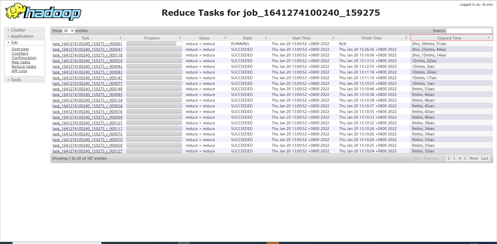

   - 点击某一Task  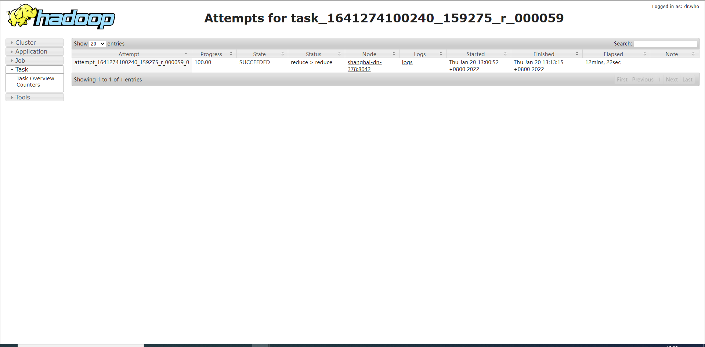

     然后点击Counters，查看此reduce相关信息

     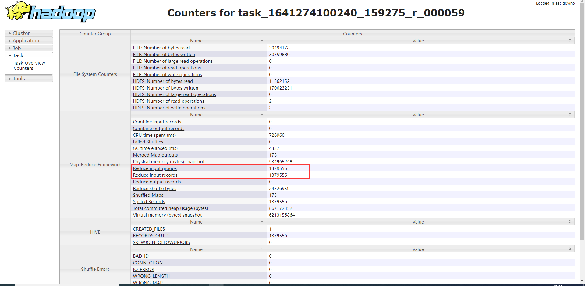

     通过比较多个reduce counter中数据量大小(bytes或者记录数)判断是否发生数据倾斜

     

3. 服务器资源不够(内存、CPU、磁盘等)

​	根据reduce执行时间，登录服务器检查服务器状态。

	-	使用jheap -map查看堆栈使用情况
	-	使用top -Hp pid查看此进程中cpu占用最高的线程并将线程id转化为16进制
	-	使用jstack -l pid|grep `线程id`    查看线程是否有死锁等情况
	-	使用top查看cpu和内存占用情况

​	正常执行reduce mem占用情况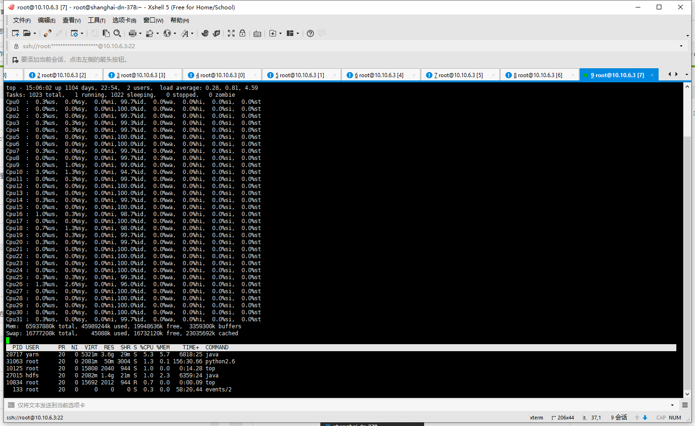

异常执行reduce mem占用情况

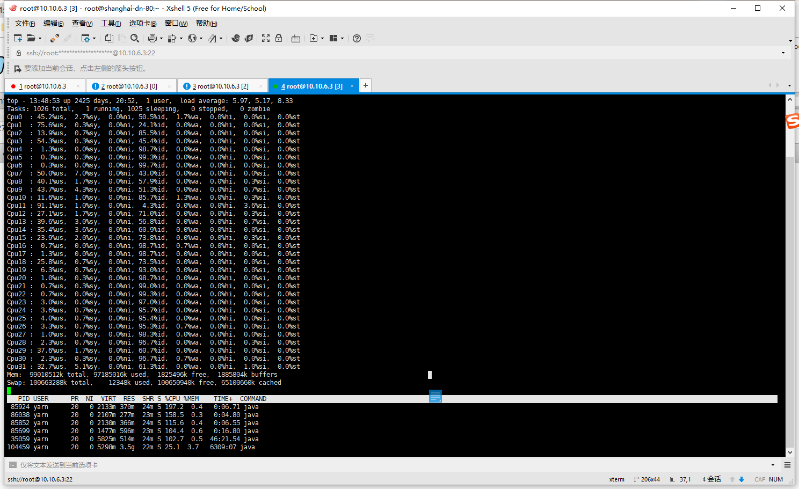

4. 函数执行时间过长

   - 查看reduce任务执行时间并排序

     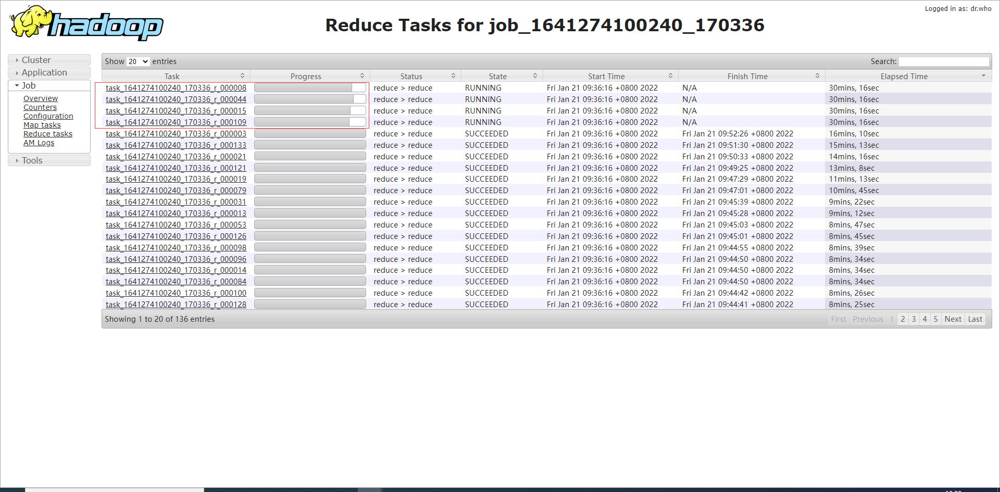

   - 查看具体某一task运行情况(根据namenode查找ip登录服务器，然后根据`attempt_1641274100240_170336_r_000008_0`查找进程id)

     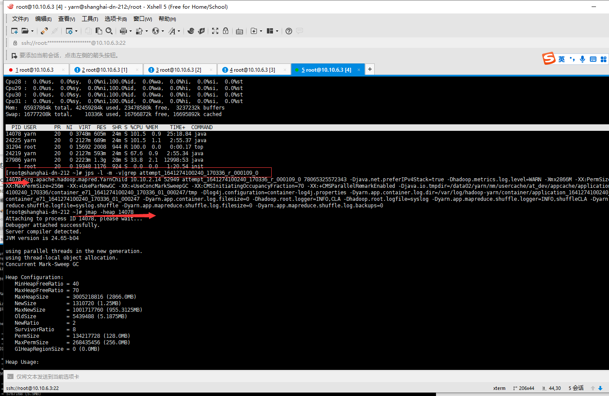

     

     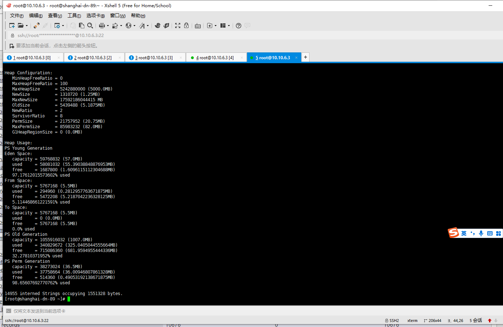

     

   - 查看堆栈空间分配是否合理

   - 根据进程id查看线程相关情况(执行时间 cpu使用等)  top -Hp `进程号`

     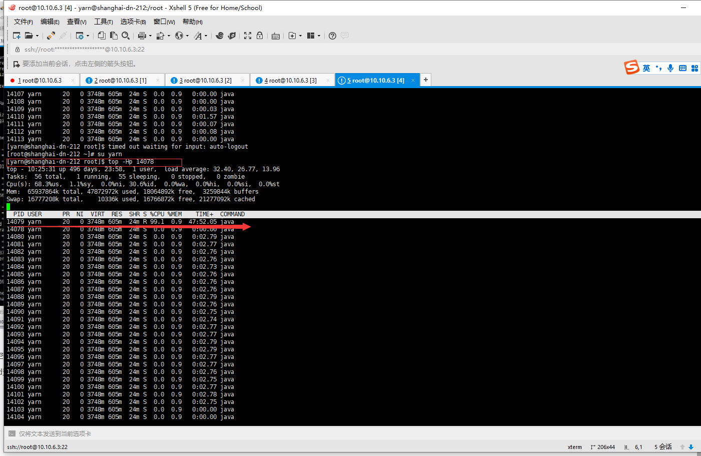

   - 查看执行时间最长线程(可根据需要分析cpu 内存等信息)

     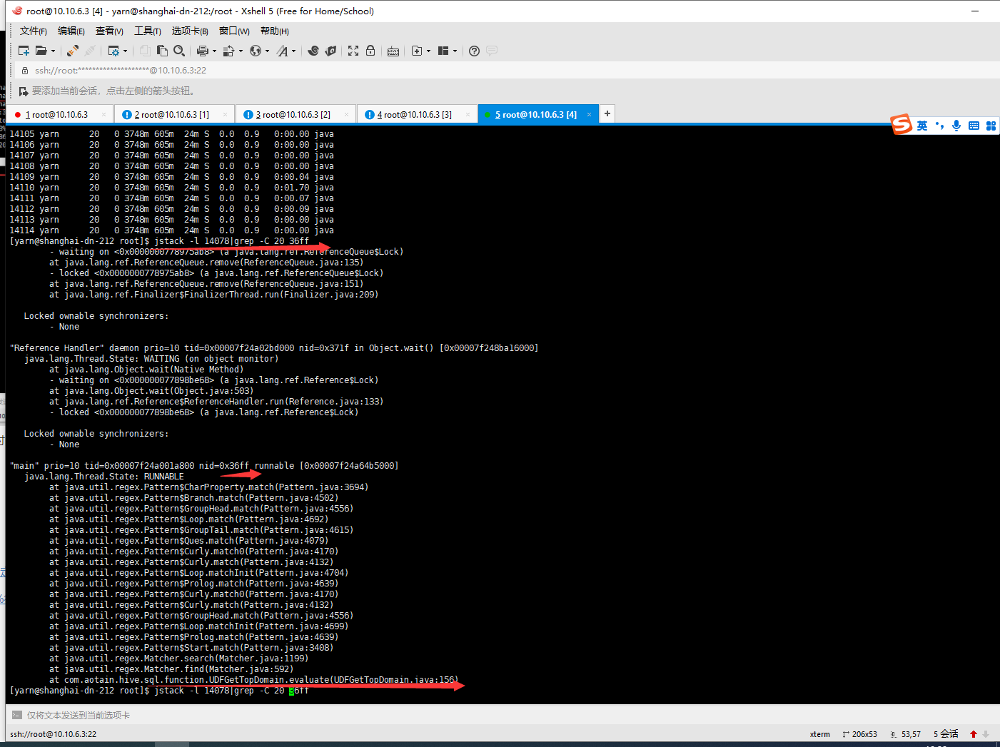

​		

​		**attempt_1641274100240_159275_r_000061_0执行情况**

​		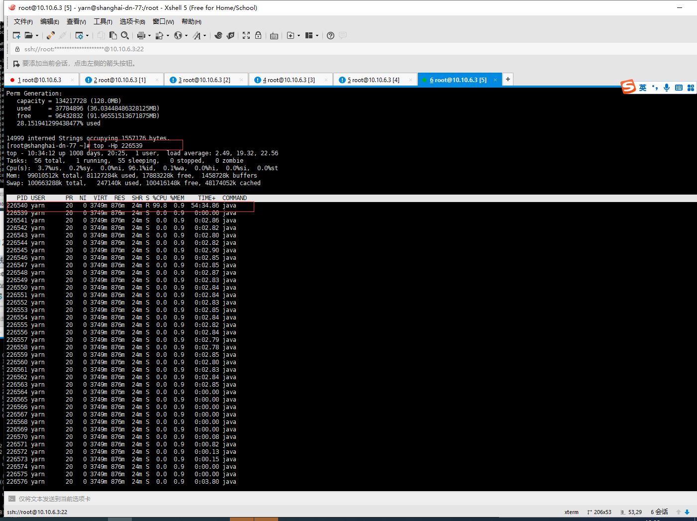

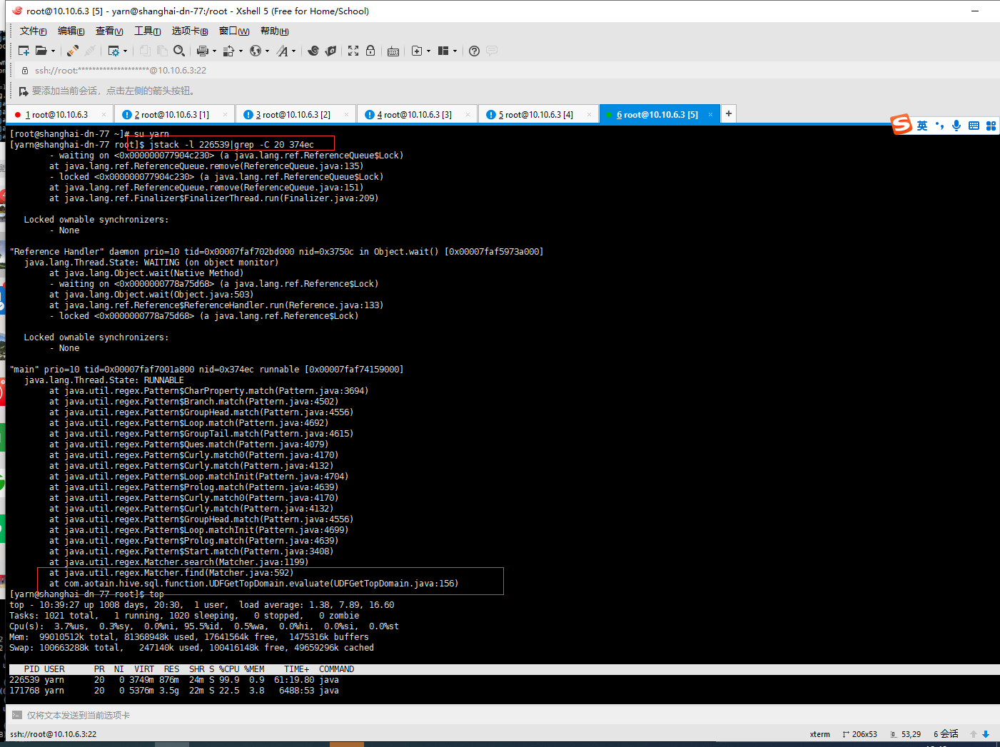

参考：

[Hive 数据倾斜问题定位排查及解决](https://blog.51cto.com/u_14932245/3289386)

[hive 卡在stage99%往往是因为数据发生了倾斜](https://blog.csdn.net/yisun123456/article/details/81743782)

